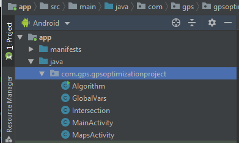

#GPS Battery Saving Project Manual
##Created by Matt

__NOTICE: Manual written for android development. iOS was not part of our development process.__

###Table of Contents

	1. Setting up Phone
	2. Setting Up Development Environment
	3. Compiling and Building App onto Phone
	4. Updates
	5. Relevant Code Snippets

###1. Setting up the Phone
Since the app requires being made a system app, There are a couple things required to have full functionality. Note: Written for Android. 

1. Go into __Developer Options__ from the Android Settings and enable __USB Debugging__
	- If there is not a develper options section, you may have to look up how to enable it for your specific device. Generally it's go to the __About Device__ section and tap "Build Number" 7 times.
2. Root the Phone
	- I know of three methods of doing this:
		1. __Doing it yourself manually__ - from quick research, you risk bricking the phone if you mess up, so make sure you follow a good tutorial
		2. __Flashing an OS ROM with root access already__ - perhaps the most convienient since you always have root access even after a factory reset, but same with previous option, make sure you know what you're doing as you could brick the phone mid process
		3. __Downloading an app that roots for you__ - easiest method, but some apps are limited to certain android versions. We used KingRoot which is limited from 4.2.2 to 5.1
			* Download link https://kingroot.en.uptodown.com/android 
3. Download an  app from the Google Play Store called "Link2sd". This will be used to make the app a system app.
	* If you have another method for making an app a system app, you most likely don't have to download this
	* Also, on some phones, the play store crashes as you type out "Link2sd" in the search bar. Don't know why, but it happens If this happens, search "2sd link" instead.

###2. Setting Up Development Environment
Relatively a simple process.

1. Download Android Studio
	* In case of issues with future updates of Android Studio, I used version 3.5 for development
2. Clone or Download the Repository
3. Open Android Studio
4. Choose Open an Existing Project
5. Navigate to the Folder of the Project (in our repository it was simply Android Studio Project) and select __GPS Optimization Project.iml__.
6. The project should now be open.

###3. Compiling and Building App on Phone
1. Plug your phone into the PC by USB.
2. There should be a prompt on the phone for USB debugging about trusting the  computer's RSA fingerprint. You will want to hit yes. 
	* There is an option to remember this RSA fingerprint in future.
3. Along one of the top bars on Android Studio should be a bar with a drop down menu and a play button. The phone you have plugged in should either be displayed already or as an option in the drop down menu. 
	* Example using my phone: 
	* If it shows up as Unknown Device, you may not have accepted the USB debugging prompt, or another error is happening.
4.  Hit the play button to build and compile onto phone. Time can range from a few seconds to a couple minutes depending upon speed of machine used and such.
5.  App should automatically open on phone when finished
6.  If first time building app on phone, make the app a system app. Instructions for Link2sd method: 
	1.  Open Link2sd, grant root access if prompted, and navigate to the app. Click on it 
		*  Our app is called GPS Optimization Project.
	2.  You should be in a screen with app name towards top. Click the button with 3 dots in top right corner
	3.  Click on the option to Convert to System app
	4.  Reboot the Device for change to take effect
7. __Important Notice__: whenever you install an app from a computer - you can only build updates from that same computer. If you want to build from a different computer, you will have to uninstall the app
	* There are some work-arounds, but I don't know how they work

### 4. Updates
Unfortunately, I don't know if it's Link2sd specific or Android in general, but updates for our system app are volatile. They'll work, but if the phone loses power - either from shutting off or running out of battery power- it will revert to the previous non-volatile state. If you need to make an update non-volatile, do the following:
	
1.  Open Link2sd, grant root access if prompted, and navigate to the app. Click on it 
		*  Our app is called GPS Optimization Project.
2.  You should be in a screen with app name towards top. Click the button with 3 dots in top right corner
3.  Click on the option to Integrate update into System
4.  Reboot the Device for change to take effect

### 5. Relevant Code Snippets
Most of our core functionality is across two files in our project - __MainActivity.java__ and __MapsActivity.java__.
In android studio they should be under app -> java -> com.gps.gpsoptimizationproject

MainActivity.java has our button for testing our code for enabling and disabling the GPS. It's also where route selection occurs

MapsActivity.java displays the map and holds the code for our algorithm. It's also where we build the route based upon the selected static route.

In MainActivity, our functions for turning on and off the GPS are called turnGPSOn and turnGPSOff respectively. Same with MapsActivity. 